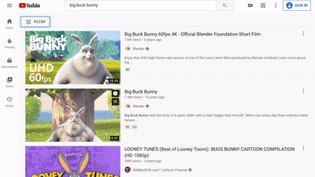

# Chompy


**Download and watch videos easily on iOS**

Chompy wraps [youtube-dl](https://youtube-dl.org/) in an API, allowing ad-free downloading and streaming on devices that can't run youtube-dl directly, such as iOS.



## Usage

1. Build & Install via Docker. Sorry, we don't have images published on DockerHub yet.


**docker cli**

```bash
docker run -p 8000:8000 \
  -e TZ=America/Los_Angeles \
  -e FORMAT= `#optional` \
  -e PLAYLIST_SYNC= `#optional` \
  -e SIZE_LIMIT= `#optional (in MiB)` \
  -v /path/to/downloads:/downloads \
  --restart unless-stopped \
  chompy
```

2. Install the associated [shortcut](https://routinehub.co/shortcut/7875/) and set your hostname.
3. Trigger a download by sharing a video URL to the shortcut. You can exit while the shortcut is downloading, but you won't be automatically redirected when the download completes.

### Show all downloads

You can see all the videos downloaded by visiting `/videos`

### Video Formats

The default format for downloaded videos is mp4, at resolutions up to 1080p. You can see the format string in [downloader/options.go](downloader/options.go).

Set the format for a download by setting the `format` request parameter. Details on format strings in [youtube-dl docs](https://github.com/ytdl-org/youtube-dl/blob/master/README.md#format-selection). For instance:

```
http -v post localhost:8000/download url="https://www.youtube.com/watch?v=L5emxkKNf9Y" format='worstvideo'
```

To change the default format for _all downloads_, set the `FORMAT` env variable

### Playlist Sync

Chompy can automatically download videos from a Youtube playlist, including your "Watch Later" list. To enable this, set the `PLAYLIST_SYNC` environment variable.

To sync private playlists (such as the "Watch Later" playlist), you need to add your cookies in a file named `.ytdl-cookies.txt` within the downloads folder. See the [youtube-dl instructions](https://github.com/ytdl-org/youtube-dl/blob/master/README.md#how-do-i-pass-cookies-to-youtube-dl) for how to extract cookies into the correct format.

```bash
docker run -e "PLAYLIST_SYNC=https://www.youtube.com/playlist?list=PLMM9FcCPG72z8fGbr-R4mLXebKcV45tkR" chompy
```

### Limit Disk Usage

Chompy can delete videos (oldest first) to keep disk usage within a specified limit. Set the `SIZE_LIMIT` environment variable (in [MiB](https://en.wikipedia.org/wiki/Byte#Multiple-byte_units)) to enable. Video deletion occurs after every successful download.

ex.
```
-e PLAYLIST_SYNC=1024 # limit to 1 GiB
```


Note that we can't predict the size of a downloaded video, so the disk usage may exceed your specified limit temporarily until cleanup is performed.

## Development

### Run locally

**Dependencies:** [ffmpeg](https://ffmpeg.org/) and [youtube-dl](https://youtube-dl.org/). API examples use [HTTPie](https://httpie.io/)

Run the app
```
go run ./cmd/chompy
```

Download something exciting

```bash
http -v post localhost:8000/download url="https://www.youtube.com/watch?v=L5emxkKNf9Y"
```

```bash
HTTP/1.1 200 OK
Content-Length: 168
Content-Type: application/json; charset=UTF-8
Date: Thu, 24 Dec 2020 23:40:11 GMT

{
    "filename": "How to Protect Your Shopping Trolley From Improvised Explosives.mp4",
    "path": "/videos/How to Protect Your Shopping Trolley From Improvised Explosives.mp4"
}
```

Then play it

```bash
http 'localhost:8000/videos/How to Protect Your Shopping Trolley From Improvised Explosives.mp4'
HTTP/1.1 200 OK
Accept-Ranges: bytes
Content-Length: 34311123
Content-Type: video/mp4
```

### Docker

```
docker build -t chompy .

docker run -p 8000:8000 --env TZ=America/Los_Angeles chompy
```
